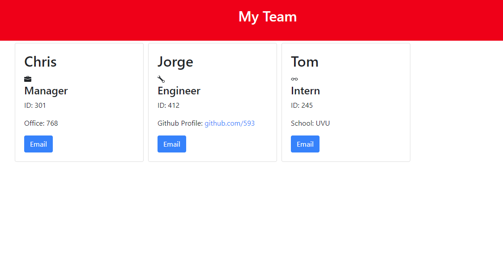

# Team Profile Generator 

## Description
This application prompts user and gathers information about one's team members. The app will create an html file based on all assembled information and it also allows user to send an email to a team member by clicking on their card button
 
## Table of Contents
 
  - [Description](##Description)
  - [How to Use it](##Instructions)
  - [Demo](##Demo)
 
 
## Instructions

  How to use:

    * Clone the repository to your computer
    * In your command line/terminal type: install npm
    * Once finished then type: node index
    * Follow prompts until finished
    * The new html file will be created in the dist directory

## Built With
  - Node.js
  - Javascipt
  - ES6
  - NPM Inquirer
  - Node File System
  
## Demo

  
  
 
  [Link to my Youtube Video showing how to use the app](https://youtu.be/31RwKB6gnkY)
 

